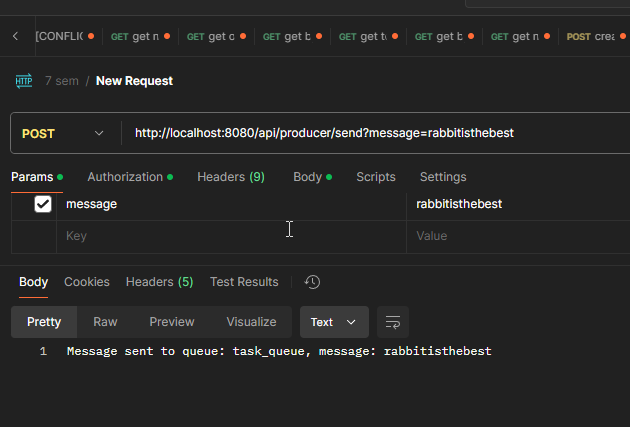
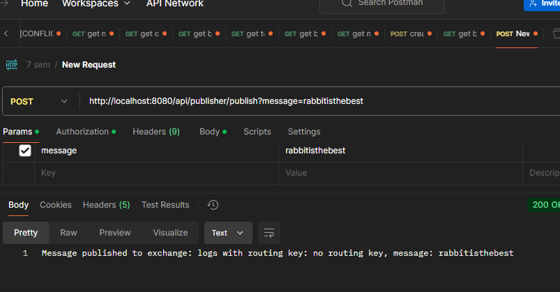
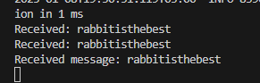
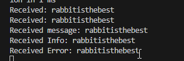

# Демо проект RabbitMQ
# Ссылка на проект: https://drive.google.com/drive/folders/16U9KorLXKu3RUnjFv8r09Cid1EhHKagA?usp=sharing

## Обзор
Этот проект демонстрирует реализацию очередей сообщений с использованием RabbitMQ в приложении Spring Boot. Он показывает различные паттерны обмена сообщениями, включая прямую отправку, публикацию/подписку и маршрутизацию.

## Предварительные требования
- Docker
- Maven
- Java 11 или выше

## Краткое руководство по запуску

### 1. Настройка RabbitMQ
Запустите контейнер RabbitMQ с помощью Docker:
```bash
docker run -d \
  --hostname rabbitmq \
  --name rabbitmq \
  -p 5672:5672 \
  -p 15672:15672 \
  rabbitmq:3-management
```

> 💡 Доступ к панели управления RabbitMQ: http://localhost:15672 (стандартные учетные данные: guest/guest)

### 2. Сборка приложения
```bash
mvn clean install
```

### 3. Запуск приложения
```bash
mvn spring-boot:run
```

Приложение будет доступно по адресу: http://localhost:8080

## Тестовые сценарии

### Сценарий 1: Отправка сообщений
Использование ProducerController для отправки сообщений

### Сценарий 2: Публикация сообщений
Использование PublisherController для распространения сообщений


Пример без ключа маршрутизации:


### Сценарии 3 и 4: Получение сообщений
Сообщения автоматически обрабатываются:
- Подписчиком: прослушивает обменник 'logs'
- Потребителем: обрабатывает сообщения из 'task_queue'



### Сценарий 5: Реализация маршрутизации
SubscriberWithRouting демонстрирует маршрутизацию сообщений:
- Сообщения с ключом маршрутизации 'info' → очередь info
- Сообщения с ключом маршрутизации 'error' → очередь error



## 📝 Примечания
- Интерфейс управления работает на порту 15672
- Брокер сообщений работает на порту 5672
- Все очереди являются постоянными и сохраняются после перезапуска брокера
